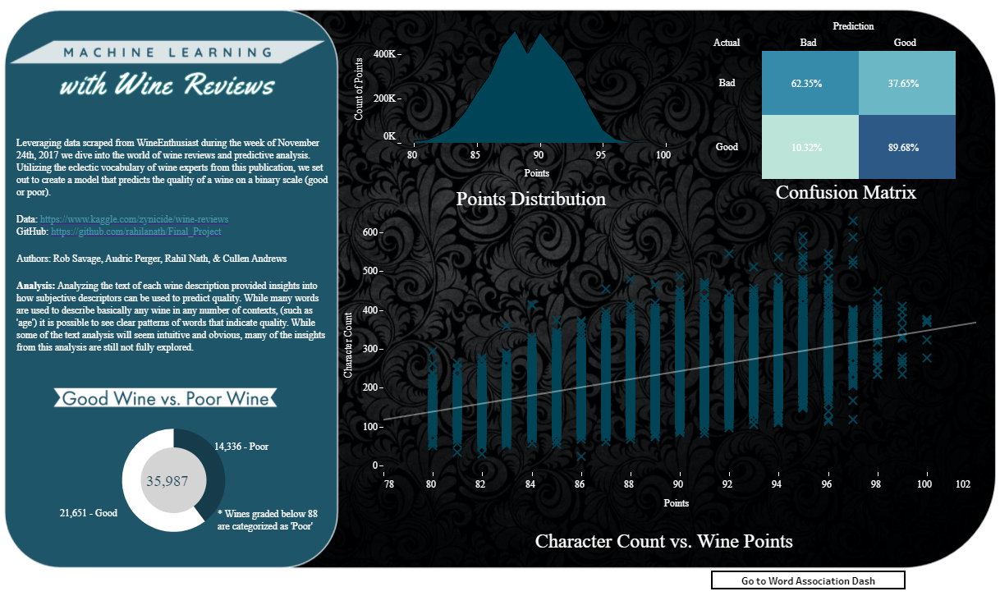
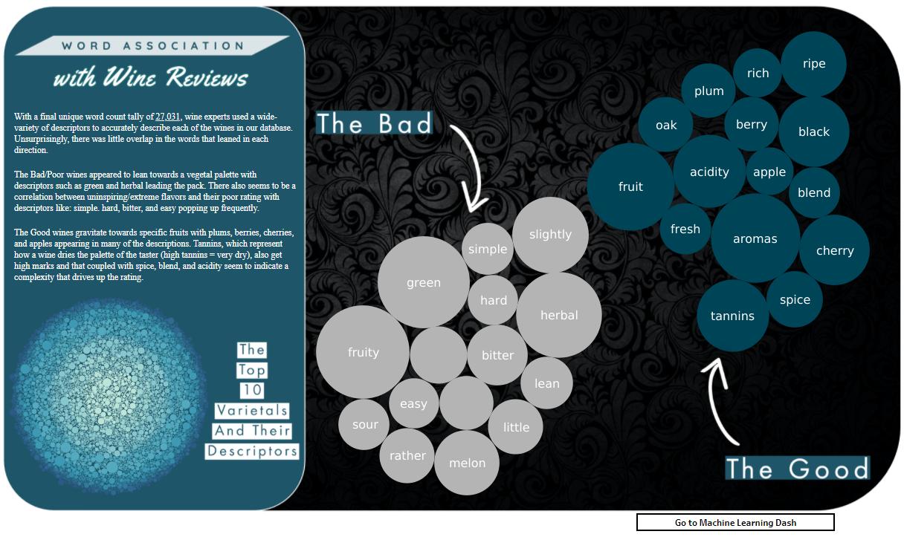

# Final_Project

# Dependancies  
Full list of dependancies in yml file. The primary tools used for the machine learning was ScikitLearn and Tensorflow

# Overview  
This project was done by myself and three other students in the University of Oregon's Data Analytics and Visualizations bootcamp. We were tasked with looking into a dataset of
our choosing to examine with machine learning. We settled on a dataset of [wine reviews](https://www.kaggle.com/zynicide/wine-reviews) scraped from the online magazine
WineEnthusiast. With this dataset, we set out to find out what predicts quality of wine according to the tasters of this magazine targeted towards wine lovers. This ended up
breaking into two primary focuses for us as a team. First, we decided to look at what we can learn from the features present on the bottle (our On-The-Bottle features), such
as price, winery, variety, etc... and examined this feature list using a random forest model and a neural network model to predict quality. The second part consisted of
examining the description text of the wine review furnished by the tasters to see what descriptors are used for wines and how that can predict quality.

# On-The-Bottle Analysis

# Text Analysis

# Additional Considerations

## Machine Learning

## Word Association

